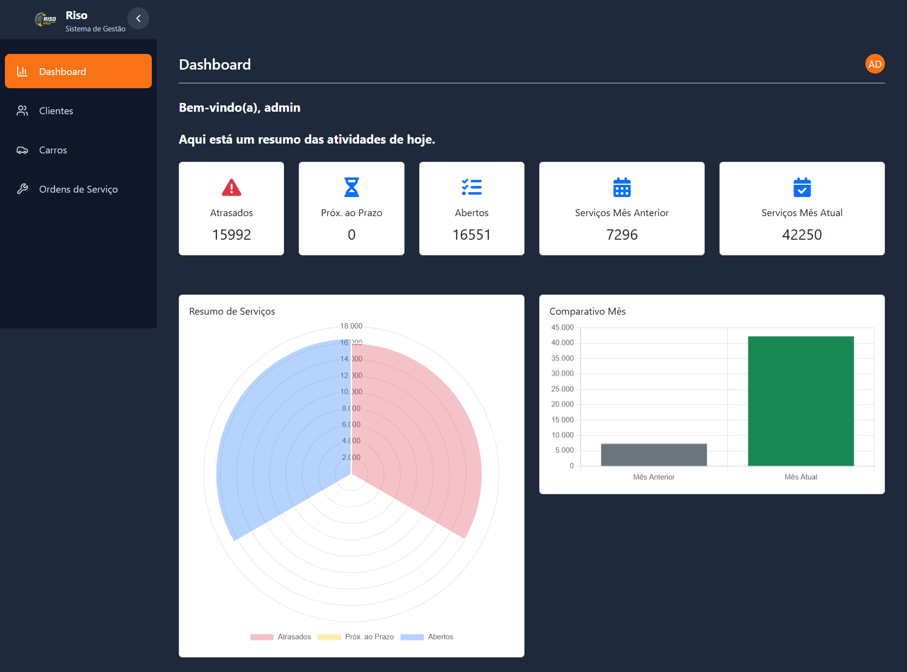
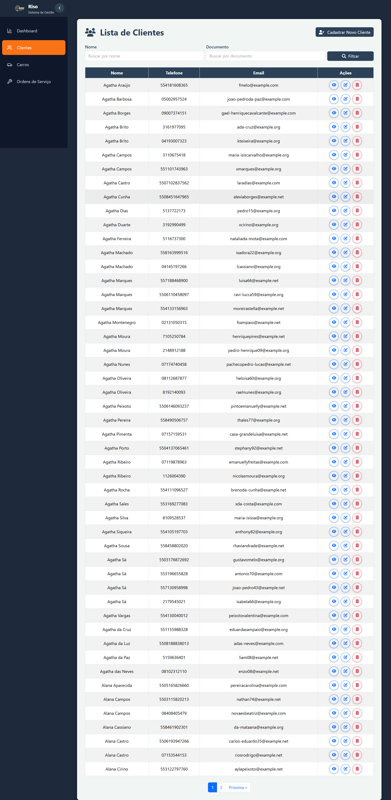
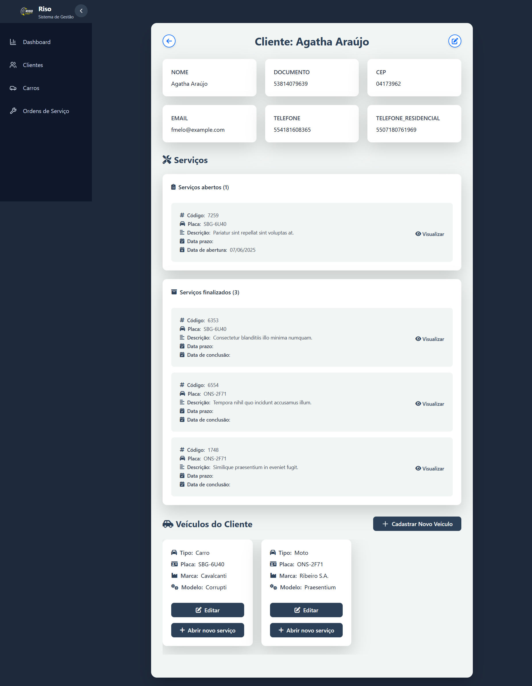
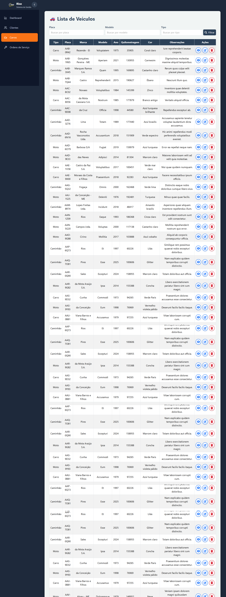
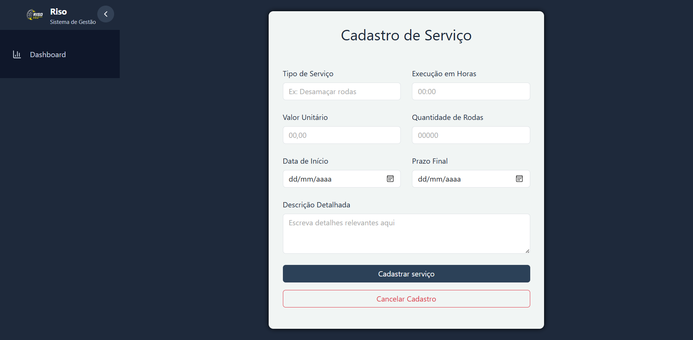

# RisoDjango

Sistema de Gestão de Serviços para Borracharia

---

## Índice
- [RisoDjango](#risodjango)
  - [Índice](#índice)
  - [Sobre o Projeto](#sobre-o-projeto)
  - [Funcionalidades](#funcionalidades)
  - [Como Rodar o Projeto](#como-rodar-o-projeto)
  - [Conexões e Banco de Dados](#conexões-e-banco-de-dados)
  - [Views Implementadas](#views-implementadas)
  - [Cobertura de Testes](#cobertura-de-testes)
  - [Imagens do Sistema](#imagens-do-sistema)
  - [Contato](#contato)
  - [Contribuintes](#contribuintes)
    - [Professores Orientadores](#professores-orientadores)

---

## Sobre o Projeto
O RisoDjango é um sistema web desenvolvido em Django para gerenciar clientes, veículos e serviços da empresa RISO - Recuperadora de rodas. O sistema permite o cadastro, edição, visualização e exclusão de clientes, veículos e serviços, além de relatórios e dashboards para acompanhamento das operações.

---

## Funcionalidades
- Autenticação de usuários
- Dashboard com KPIs
- Cadastro, listagem, edição e exclusão de clientes
- Cadastro, listagem, edição e exclusão de veículos
- Cadastro, listagem, edição, finalização, cancelamento e exclusão de serviços
- Filtros e paginação nas listagens
- Visualização detalhada de clientes, veículos e serviços
- Relatórios de serviços finalizados e cancelados

---

## Como Rodar o Projeto

1. **Clone o repositório:**
   ```bash
   git clone <url-do-repositorio>
   cd RisoDjango
   ```
2. **Crie e ative um ambiente virtual (opcional, mas recomendado):**
   ```bash
   python -m venv venv
   .\venv\Scripts\activate
   ```
3. **Instale as dependências:**
   ```bash
   pip install -r requirements.txt
   ```
4. **Configure o MongoDB:**
   - O sistema utiliza MongoDB local (localhost:27017) com o banco `riso`.
   - Certifique-se de que o serviço do MongoDB está rodando.
5. **Execute as migrações do Django:**
   ```bash
   python manage.py migrate
   ```
6. **Crie um superusuário (opcional):**
   ```bash
   python manage.py createsuperuser
   ```
7. **Rode o servidor de desenvolvimento:**
   ```bash
   python manage.py runserver
   ```
8. **Acesse:**
   - [http://localhost:8000/](http://localhost:8000/)

---

## Conexões e Banco de Dados
- **Banco principal:** SQLite (Django ORM)
- **Banco de dados não relacional:** MongoDB (localhost:27017, banco `riso`)
- As coleções do MongoDB são utilizadas para clientes, veículos, serviços e usuários.
- Configuração de conexão está em `core/services/db_connection.py`.

---

## Views Implementadas
- **Autenticação:** login, logout
- **Dashboard:** KPIs e resumo do sistema
- **Clientes:** cadastro, listagem, edição, exclusão, visualização
- **Veículos:** cadastro, listagem, edição, exclusão, visualização
- **Serviços:** cadastro, listagem, edição, finalização, cancelamento, exclusão, visualização, relatórios de finalizados/cancelados

---

## Cobertura de Testes
- Cobertura de testes: **63%** (de acordo com o relatório do Coverage)
- Para rodar os testes e gerar o relatório:
   ```bash
   coverage run manage.py test
   coverage html
   ```
   O relatório estará disponível na pasta `htmlcov/index.html`.

---

## Imagens do Sistema

> **Adicione aqui prints das principais telas do sistema:**
>
> 
> 
> 
> 
> 

---

## Contato
- Projeto acadêmico - Fatec

---

## Contribuintes

- [Izabely Campos (frontend / doc)](https://github.com/izabelycamposs)
- [Casemiro S Junior (backend / frontend)](https://github.com/CasemiroSJunior/)
- João Vitor de Camargo (backend/frontend)
- [Lafreit (documentação)](https://github.com/Lafreit)


### Professores Orientadores

- [Orlando Saraiva Jr. (Programação WEB III)](https://github.com/orlandosaraivajr)
- [Thiago Gonçalves Mendes (Banco de dados não relacional - MongoDB)](https://www.linkedin.com/in/thiagogoncalvesmendes/)
- [Renato C. Matthiesen (Gestão de Projetos Ágeis)](https://www.linkedin.com/in/renatocmatthiesen/)
- [Leonardo Souza Lima (Interface Humano Computador)](https://www.linkedin.com/in/leonardosouzalima/)

